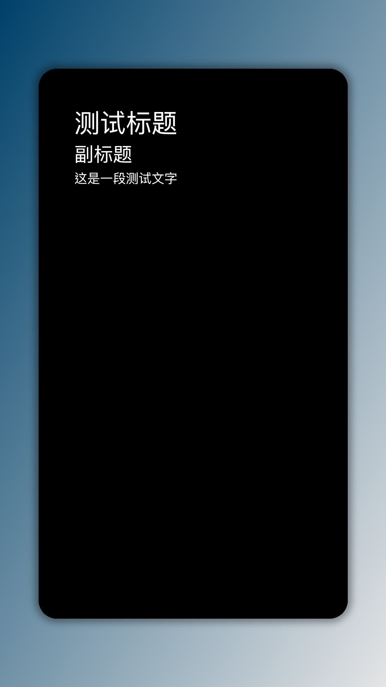

# 仿流光卡片生成api

这是一个基于 `color_zh.json` 中的颜色组合生成渐变图片的 Python 脚本。每张图片都会根据指定的颜色创建一个渐变效果，并可在图片中央显示 Markdown 格式的文本内容。

## 功能特点

- 生成 1080x1920 像素的渐变图片
- 支持双色和多色渐变
- 使用 `color_zh.json` 中的颜色数据
- 输出 PNG 格式的图片
- 为每个颜色组合创建单独的图片
- 支持多种渐变方向：垂直、水平、对角线、右下角（默认）
- 支持 Markdown 文本渲染
- Markdown 内容中的 URL 自动显示为蓝色
- 可自定义中央矩形的背景色（默认为白色 #FFFFFF）
- 根据背景色自动调整文本颜色，确保可读性

## 环境要求

- Python 3.x
- Pillow
- numpy
- Flask
- markdown2
- beautifulsoup4
- playwright
- emoji
- requests

## 安装步骤

1. 克隆项目到本地：
```bash
git clone [项目地址]
cd color_card_api
```

2. 创建并激活虚拟环境（可选但推荐）：
```bash
python -m venv venv
# Windows
venv\Scripts\activate
# macOS/Linux
source venv/bin/activate
```

3. 安装依赖包：
```bash
pip install -r requirements.txt
```

4. 安装 Playwright 依赖：
```bash
playwright install chromium
```

## 命令行使用

```bash
# 基本用法
python color_card_api.py <颜色ID> --markdown "## 这是标题\n这是内容"

# 从文件读取 Markdown 内容
python color_card_api.py <颜色ID> --markdown "@path/to/markdown_file.md"

# 指定背景色（十六进制）
python color_card_api.py <颜色ID> --markdown "内容" --background-color "#FFFFFF"

# 指定渐变方向
python color_card_api.py <颜色ID> --markdown "内容" --direction "vertical"
```

可用的渐变方向选项：
- `vertical`：垂直渐变
- `horizontal`：水平渐变
- `diagonal`：对角线渐变
- `bottom-right`：右下角渐变（默认）

## API 服务

### 启动服务

```bash
# 启动 API 服务（默认端口 5001）
python color_card_api.py
```

### API 接口文档

#### 生成渐变色卡片

**接口**: `/generate_color_picture`  
**方法**: POST  
**Content-Type**: application/json

**请求参数**:

| 参数名 | 类型 | 必填 | 说明 | 示例 |
|--------|------|------|------|------|
| id | number | 是 | 颜色组合ID（从 color_zh.json 中获取） | 1 |
| markdown | string | 是 | 要显示在图片上的 Markdown 文本 | "# 标题\n## 副标题" |
| background_color | string | 否 | 中心矩形的背景色（十六进制颜色码），默认为 #FFFFFF（白色） | "#FFFFFF" |
| direction | string | 否 | 渐变方向，可选值：vertical、horizontal、diagonal、bottom-right，默认为 bottom-right | "bottom-right" |

**响应**:
- 成功：返回 PNG 图片文件
- 失败：返回 JSON 格式错误信息

**错误码**:
- 400: 请求参数错误
- 404: 颜色 ID 不存在
- 500: 服务器内部错误

**curl 调用示例**:

```bash
curl -X POST http://localhost:5001/generate_color_picture \
  -H "Content-Type: application/json" \
  -d '{
    "id": 1,
    "markdown": "# 深蓝渐变色卡\n\n这是一个从深蓝色 (#00416A) 渐变到浅灰色 (#E4E5E6) 的优雅配色。\n\n## 适用场景\n- 企业网站\n- 商务演示\n- 科技产品\n\n官网：https://example.com",
    "background_color": "#FFFFFF",
    "direction": "bottom-right"
  }' \
  --output gradient_test.png
```

**Python 调用示例**:

```python
import requests

url = "http://localhost:5001/generate_color_picture"
data = {
    "id": 1,
    "markdown": """# 深蓝渐变色卡

这是一个从深蓝色 (#00416A) 渐变到浅灰色 (#E4E5E6) 的优雅配色。

## 适用场景
- 企业网站
- 商务演示
- 科技产品

官网：https://example.com""",
    "background_color": "#FFFFFF",
    "direction": "bottom-right"
}

response = requests.post(url, json=data)

if response.status_code == 200:
    with open("gradient_test.png", "wb") as f:
        f.write(response.content)
    print("图片已保存为 gradient_test.png")
else:
    print("错误:", response.json())
```

### Markdown 支持特性

支持的 Markdown 语法包括：
- 标题（# 一级标题，## 二级标题等）
- 列表（有序列表和无序列表）
- 粗体和斜体（**粗体**，*斜体*）
- 代码块（使用 ``` 包围的代码）
- 引用（> 引用文本）
- 链接（[链接文本](URL)）
- 网址自动识别（网址文本会自动以蓝色 #0066CC 显示）
- 表格

### 注意事项

1. API 服务默认监听 0.0.0.0:5001，可以通过修改代码更改
2. 生成的图片默认保存在 gradient_images 目录下
3. 建议在生产环境中使用 WSGI 服务器（如 Gunicorn）部署
4. 背景色必须是合法的十六进制颜色码（例如 #FFFFFF）
5. 如果背景色为深色，文本将自动调整为白色；如果背景色为浅色，文本将自动调整为深灰色
6. Markdown 中包含的网址会自动显示为蓝色 (#0066CC)

## 文件结构

- `color_card_api.py`：主程序文件，包含 API 和命令行功能
- `color_zh.json`：颜色数据文件
- `JetBrainsMono-Regular-2.ttf`：用于渲染文本的字体文件
- `gradient_images/`：生成的图片保存目录
- `requirements.txt`：项目依赖文件

## 测试示例

### 示例图片

以下是使用 ID 为 1 的深蓝渐变色生成的测试图片：



参数：
- 颜色组合：深蓝 (#00416A) 到浅灰 (#E4E5E6)
- 背景色：#FFFFFF（白色）
- Markdown 文本：
  ```markdown
  # 测试标题
  ## 副标题
  这是一段测试文字
  
  官网：https://example.com
  ```

生成的图片中，"https://example.com" 会以蓝色显示。

你可以在 `gradient_images` 目录下找到更多生成的图片示例。每个图片都以 `gradient_{id}_{name}_{uuid}.png` 的格式命名，其中：
- `id`: 颜色组合的 ID
- `name`: 颜色组合的名称
- `uuid`: 唯一标识符，确保文件名不重复